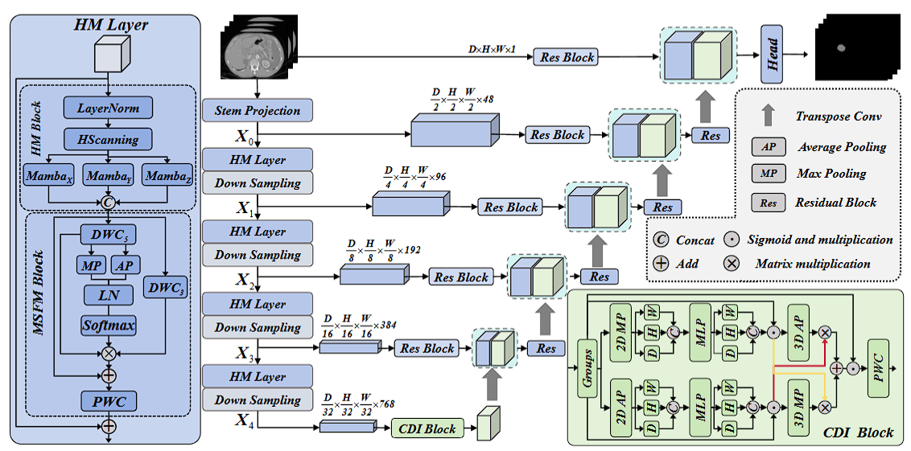
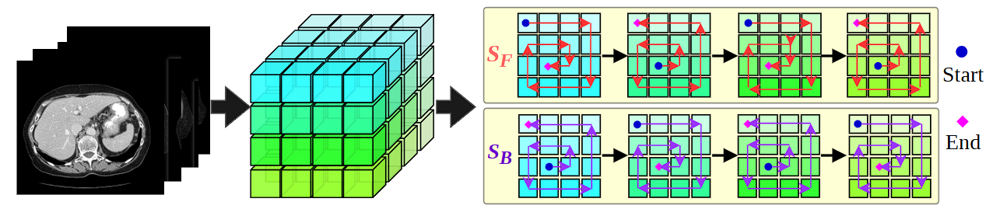
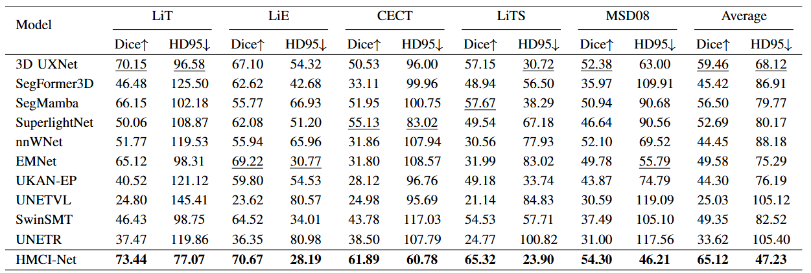
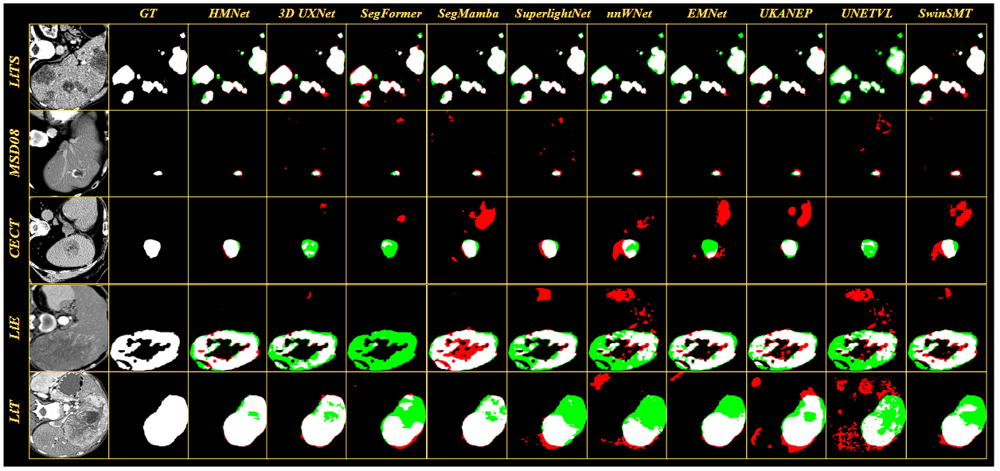
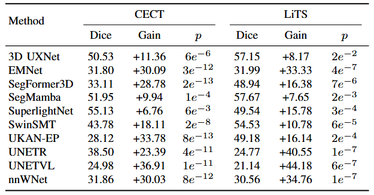
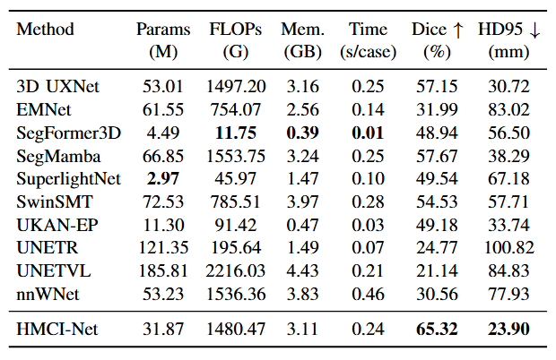
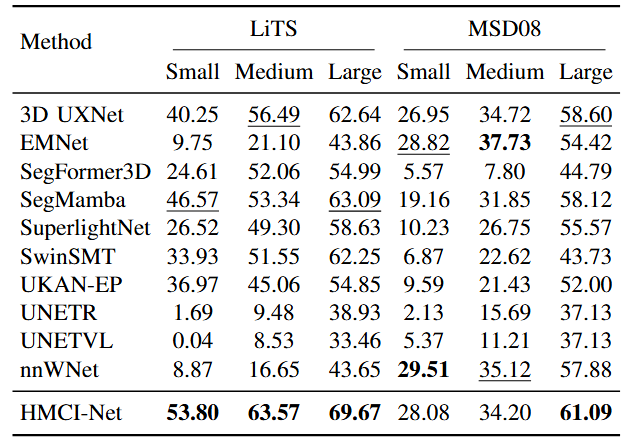
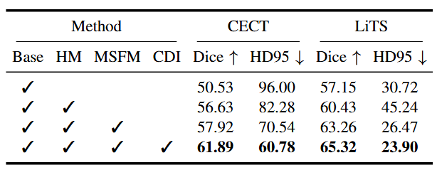
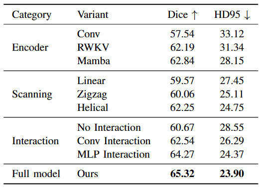

# HMCI-Net

**HMCI-Net: Toward Accurate Liver Tumor Segmentation via Helical Mamba and Cross-Directional Interaction**

This repository provides an anonymized implementation of **HMCI-Net** for double-blind review. The release contains the core network code, a LiTS training/evaluation example, and manuscript figures.

<p align="center">
  
</p>

## Highlights

HMCI-Net is a 3D liver tumor segmentation framework for contrast-enhanced CT. It is designed around two observations: common volumetric scanning patterns may disrupt inter-slice voxel continuity, and conventional bottleneck designs often lack explicit cross-directional high-level interaction. The manuscript also introduces a large-scale liver tumor dataset to support more comprehensive evaluation of liver tumor and tumor-enhancement segmentation.

**Key Contributions:**

1. **HMCI-Net with continuity-aware Mamba modeling and cross-directional interaction.** We propose HMCI-Net, a 3D segmentation framework built with a **Helical Mamba (HM) Layer**, **Alternating Helical Scanning**, **Multi-scale Structural Feature Modulation (MSFM)**, and a **Cross-Directional Interaction (CDI) Block**. These modules preserve inter-slice continuity, enhance structural details, and strengthen bottleneck-level directional interaction for liver tumor localization.
2. **A large-scale liver tumor dataset.** We construct **LiTE**, a contrast-enhanced CT dataset for liver tumor analysis. It contains two complementary subsets: **LiT** for whole liver-tumor annotations and **LiE** for tumor-enhancement-region annotations. For anonymous review and data governance reasons, the dataset itself is not redistributed in this repository, but the release notice is provided below.
3. **Strong segmentation performance.** Extensive experiments show that HMCI-Net achieves accurate and robust liver tumor segmentation, with consistent gains in quantitative comparison, qualitative visualization, statistical significance, complexity analysis, tumor-size stratified evaluation, and ablation studies.

**Core Implementation Components:**

- **Helical Mamba (HM) Layer:** combines tri-directional bidirectional helical Mamba modeling with multi-scale structural modulation.
- **Alternating Helical Scanning:** serializes volumetric features into forward and reverse helical sequences while preserving cross-slice continuity.
- **Multi-scale Structural Feature Modulation (MSFM):** fuses volumetric receptive-field responses and local structural responses to enhance fine details.
- **Cross-Directional Interaction (CDI) Block:** strengthens bottleneck-level cross-directional interaction and lesion-aware localization.
- **LiTS Example Pipeline:** provides a public-dataset example for training, validation, and reproducible code usage.

## Method At A Glance

Let an input CT volume be denoted as:

$$
I \in \mathbb{R}^{1 \times D \times H \times W},
\quad
Y \in \{0,1,2\}^{D \times H \times W}.
$$

Here, labels `0`, `1`, and `2` correspond to background, liver, and tumor in the LiTS-style setting. The encoder produces hierarchical features:

$$
X_i \in \mathbb{R}^{C_i \times D_i \times H_i \times W_i},
\quad i \in \{0,1,2,3,4\}.
$$

### Helical Mamba Layer

Each HM layer first normalizes the input feature and then sends it to a tri-directional helical Mamba block. The feature is scanned along three orthogonal views, and each view contains a forward helical sequence and a reverse helical sequence:

$$
\{S_F^a, S_B^a\}, \quad a \in \{D,H,W\}.
$$

The helical scan traverses neighboring slices and in-plane regions in an alternating manner, reducing direction-dependent bias and improving continuity-aware long-range modeling.

<p align="center">
  
</p>

### Multi-scale Structural Feature Modulation

After helical Mamba modeling, MSFM enhances structural details by combining global volumetric responses and local depth-wise convolutional responses:

$$
\hat{X}_i =
\mathrm{MSFM}
(
\mathrm{HM}
(
\mathrm{LN}(X_i)
)
).
$$

This design improves the representation of heterogeneous tumor appearances, irregular shapes, and ambiguous boundaries.

### Cross-Directional Interaction Block

At the bottleneck, CDI performs group-wise directional attention. Given bottleneck feature $X_4$, channels are divided into $G$ groups. Each group constructs average-pooling and max-pooling branches along the depth, height, and width axes. The two branches then interact through cross-branch spatial weighting:

$$
A^g =
\sigma
(
q_{\mathrm{avg}}^g R_{\mathrm{max}}^g
+
q_{\mathrm{max}}^g R_{\mathrm{avg}}^g
).
$$

Here, $q_{\mathrm{avg}}^g$ and $q_{\mathrm{max}}^g$ are branch descriptors, while $R_{\mathrm{avg}}^g$ and $R_{\mathrm{max}}^g$ are reshaped spatial responses. The final bottleneck output is:

$$
F_{\mathrm{CDI}} =
\mathrm{PWC}
(
\mathrm{Concat}_{g=1}^{G}
(
A^g \odot X_4^g
)
).
$$

CDI improves lesion-focused localization by allowing smooth contextual cues and salient structural cues to complement each other.

## Repository Structure

```text
GitHub/
|-- README.md
|-- requirements.txt
|-- .gitignore
|-- assets/
|   |-- architecture.png
|   |-- helical_scanning.png
|   |-- quantitative_results.png
|   |-- qualitative_results.png
|   |-- significance_table.png
|   |-- complexity_table.png
|   |-- tumor_size_table.png
|   |-- ablation_components.png
|   `-- ablation_design.png
`-- Code/
    |-- 1_Train_LITS_main.py
    |-- Reference_LITS.py
    |-- load_datasets_transforms.py
    |-- networks/
    |   `-- Heiix_Mamba/
    |       `-- HM.py
    |-- light_training/
    |-- monai_utils/
    `-- data_process/
```

## Environment

The code was developed with Python 3.10+, PyTorch, and MONAI.

```bash
conda create -n hmci_net python=3.10 -y
conda activate hmci_net

# Install a PyTorch build matching your CUDA version.
# Example for CUDA 11.8:
pip install torch torchvision torchaudio --index-url https://download.pytorch.org/whl/cu118

pip install -r requirements.txt
```

## Dataset Preparation

This anonymized release uses **LiTS** as the public-dataset example. Please download LiTS from the official source and convert images and labels to NIfTI format if needed.

Arrange the processed data as:

```text
data/
`-- LITS/
    `-- crop/
        |-- imagesTr/
        |   |-- case_000.nii.gz
        |   `-- ...
        |-- labelsTr/
        |   |-- case_000.nii.gz
        |   `-- ...
        |-- imagesVal/
        |   |-- case_100.nii.gz
        |   `-- ...
        `-- labelsVal/
            |-- case_100.nii.gz
            `-- ...
```

Filename pairing is strict:

```text
imagesTr/case_000.nii.gz  <->  labelsTr/case_000.nii.gz
imagesVal/case_100.nii.gz <->  labelsVal/case_100.nii.gz
```

For LiTS-style labels, this code assumes:

```text
0: background
1: liver
2: tumor
```

## Quick Start On LiTS

Run commands from the `Code/` directory.

```bash
cd Code
```

### Training

```bash
python 1_Train_LITS_main.py \
  --root ../data/LITS/crop \
  --dataset Task03_Liver \
  --network HM \
  --output_parameter ../parameters/HMCI_LITS.pth \
  --img_size 128 128 128 \
  --batch_size 1 \
  --crop_sample 2 \
  --max_iter 70000 \
  --eval_step 200 \
  --gpu 0
```

Key arguments:

| Argument | Description |
| :-- | :-- |
| `--root` | Dataset root containing `imagesTr`, `labelsTr`, `imagesVal`, and `labelsVal`. |
| `--dataset` | Use `Task03_Liver` for LiTS-style liver/tumor segmentation. |
| `--network` | Use `HM` to train HMCI-Net. |
| `--output_parameter` | Path where the best checkpoint is saved. |
| `--img_size` | 3D ROI size. The example uses `128 128 128`. |
| `--crop_sample` | Number of foreground/background cropped sub-volumes sampled per case. |

### Validation / Inference

```bash
python Reference_LITS.py \
  --root ../data/LITS/crop \
  --dataset Task03_Liver \
  --network HM \
  --mode validation \
  --pretrained_weights ../parameters/HMCI_LITS.pth \
  --save_dir ../outputs/HMCI-Net_LiTS \
  --img_size 128 128 128 \
  --val_batch 2 \
  --gpu 0
```

Predictions and case-level outputs are saved under `outputs/`.

## Results Preview

The figures below are provided for anonymous review visualization only.

### Quantitative Comparison

<p align="center">
  
</p>

### Qualitative Results

In the error maps, white indicates true-positive segmentation, red indicates false-positive regions, and green indicates false-negative missed regions.

<p align="center">
  
</p>

### Statistical Significance

<p align="center">
  
</p>

### Complexity Analysis

<p align="center">
  
</p>

### Tumor-Size Stratified Analysis

<p align="center">
  
</p>

### Ablation Study

<p align="center">
  
</p>

<p align="center">
  
</p>

## Dataset Release Notice

The manuscript introduces **LiTE**, a large-scale contrast-enhanced CT dataset for liver tumor and tumor-enhancement segmentation. LiTE is designed to support both lesion-level liver tumor segmentation and enhancement-region analysis. It contains two subsets:

```text
LiT: whole liver-tumor annotations
LiE: tumor-enhancement-region annotations
```

The dataset is not included in this anonymous repository because the current release is prepared for double-blind review and the data must follow de-identification, data-use, and governance procedures. Public release will be considered after the review period and the required approvals are completed.

## Intended Use

This repository is intended for academic research and reproducibility. It is not a medical product and must not be used for clinical decision-making.
